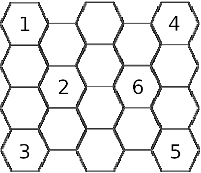

# A hermit tends to a garden under the silvery light of a lone Sunstar

There is a garden in this place in-between worlds. A hermit tends to this garden, growing flowers that sing, trees that make no shade, and fruits that feed you your own happy memories.

A mote of light that is too far to be a sun and too close to be a star is neither and both. It sheds its silvery, preternatural light upon the garden and that is soft and shadowless.

The hermit needs something. They also hold a secret. Which will they reveal and which will you have to find out to get out of this displaced place.

\ 

## Locations

------------------------------------------------ 
location   Description
---------  ------------------------------------- 
1          The study, it is a circle of
           pillars with modest furnishings.

2          A locked hut. Inside it seems
           medical and pharmacological
           experiments can be conducted.

3          A tall translucid tree that when
           touched, imparts the necessary
           knowledge to solve a single
           problem. Whether the solition is
           a good one is debatable.

4          The aftermath of a catastrophe.
           Here the garden has been partially
           destroyed by a battle.

3          A gazebo where a single apprentice
           sorts the treasures of the last
           harvest.

6          A treatise on the nature of the
           garden sits atop a stone pedestal.
           The handwriting changes throughout
           the book.
------------------------------------------------ 

## 1d6 Encounters

1. A sphynx sits among golden flowers. They ask a rhethorical question that is key to undesrtanding this place;
2. An exit to this place, but to take it, each of you must give up something precious you can never have again;
3. Lighning-fast moon pixies feel like playing wicked games that involve sharp, pointy things, blood and at least one death;
4. A devil offers treasure and the knowledge of the secret of this place in exchange to being freed from its bondage;
5. You find a chest with the moon etched onto its lid. If you manage to open its sophisticated contraption, you will find a magical, luminous globe. WHat does it do?
6. The Hermit finds you and offers to tell you a secret or to accept helping them. Both are unpleasant and neither is escapable.